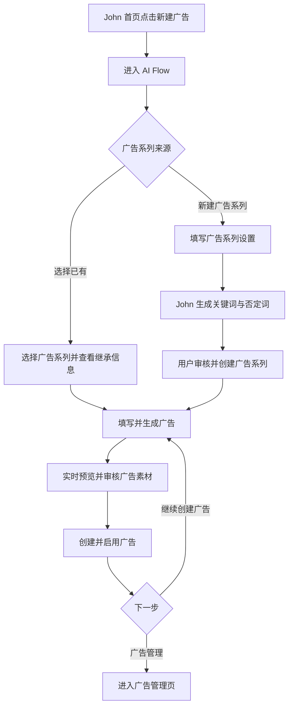

# John 新建广告 AI Flow PRD

## 1. 文档信息

- 产品：OntoZ 工作台
- 所属模块：24/7 投流 John
- 功能：新建广告
- 版本：V0.1
- 文档状态：待评审
- 目标路由：`#john/create-ad`
- 设计参考：Lily、Wendy 的独立 AI Flow 页面；John 现有广告系列与广告创建 demo

## 2. 背景与问题

John 当前把“新建广告系列”和“新建广告”拆成两个弹窗，用户需要先创建系列、退出弹窗、再从其他入口新建广告。广告系列与广告之间的上下文不连续，且关键词目前在广告层生成，和同一广告系列下多个广告共享投放范围与搜索意图的关系不一致。

本次将新建流程重构为一条独立的 AI Flow：用户从 John 首页进入后，先创建或选择广告系列，再在同一页面完成广告素材配置与预览，最后决定进入广告管理或继续创建广告。

## 3. 产品目标

1. 用一条连续流程完成“确定广告系列 → 创建广告”，减少页面跳转和重复输入。
2. 将关键词与否定词从广告层迁移到广告系列层，使同一系列下的广告共享搜索意图。
3. 让 John 在关键步骤展示分析过程、生成结果和可编辑建议，形成与 Lily、Wendy 一致的 AI Flow 体验。
4. 在广告编辑阶段提供实时预览，降低提交后才发现文案问题的概率。
5. 创建完成后支持连续生产多个广告，并复用刚才的广告系列上下文。

## 4. 非目标

- 本期仅覆盖 Google Search 广告，不新增其他广告平台或广告类型。
- 本期不重构广告系列管理、广告管理和首页数据看板。
- 本期不包含充值、支付、账户授权、Google Ads 审核及真实发布接口。
- 本期不提供跨广告系列复制广告、批量创建广告或 A/B 实验能力。
- 本期不在广告阶段单独维护关键词。

## 5. 核心产品原则

### 5.1 一条任务，一条 Flow

- John 首页保留一个主要入口“新建广告”。
- 点击后进入独立 AI Flow 页面，不使用全屏弹窗或多个串联弹窗。
- 页面内按任务进度逐步追加卡片和结果，已完成步骤可返回修改。

### 5.2 广告系列定义投放上下文

广告系列统一维护：

- 独立站域名
- 投放国家
- 产品线
- 广告系列名称
- 开始日期、结束日期
- 日预算
- 关键词
- 否定词

广告继承所属广告系列的域名、市场、产品线、预算上下文、关键词和否定词，不在广告层重复生成或保存关键词。

### 5.3 先生成，再审核

- John 可以基于网站、产品线和目标市场生成关键词、广告文案、站内链接与宣传信息。
- AI 生成结果必须允许用户增删、编辑、选择或重新生成。
- 用户确认前不把 AI 结果视为最终投放内容。

## 6. 用户故事

- 作为首次投放的用户，我希望在新建广告时同时创建广告系列，不需要先退出当前流程。
- 作为已有广告系列的用户，我希望直接选择一个系列并创建新广告，避免重复配置范围和关键词。
- 作为运营人员，我希望审核并修改 John 生成的关键词与文案，确保内容符合业务事实。
- 作为连续投放的用户，我希望创建完成后继续在同一广告系列下创建另一个广告。
- 作为管理人员，我希望创建完成后直接进入广告管理页查看结果。

## 7. 入口、路由与退出

### 7.1 入口

- John 首页主按钮：“新建广告”。
- 点击后进入 `#john/create-ad`。
- 广告管理页的“新建广告”后续可复用同一路由，并通过参数预选当前广告系列；不属于本期首页重构的强制范围。

### 7.2 页面顶栏

- 返回按钮：“返回 John”。
- 页面标题：“John 正在为你创建广告”。
- 辅助操作：“重新开始”。
- 风格参考 Lily、Wendy 的 AI Flow 顶栏和居中会话区域。

### 7.3 中途退出

- 用户尚未产生有效修改时，直接返回 John 首页。
- 用户已填写字段或生成内容时，返回、刷新或重新开始前提示“当前内容尚未创建，是否离开”。
- 本期不要求跨设备恢复草稿；同一浏览器会话内可保留未提交内容。

## 8. 整体流程



## 9. 页面结构

桌面端采用“会话主区 + 上下文侧栏”的结构：

1. 顶栏
   - 返回 John
   - 当前任务标题
   - 重新开始
2. 会话主区
   - 步骤卡片
   - John 分析过程
   - AI 生成结果
   - 用户确认操作
3. 右侧上下文区
   - 广告系列阶段：展示当前系列摘要或关键词统计
   - 广告阶段：固定展示 Google 搜索广告实时预览
4. 底部操作区
   - 上一步
   - 主操作按钮
   - 当前进度说明

小屏端不保留双栏：广告预览放在广告编辑卡片上方，支持折叠和展开，不产生页面级横向滚动。

## 10. 详细功能需求

### 10.1 Step 1：选择广告系列来源

页面首先询问：“这条广告要放到哪个广告系列？”

提供两个互斥选项：

1. 从已有广告系列开始
   - 说明：复用已有投放范围、预算和关键词。
2. 新建广告系列
   - 说明：配置新的投放范围，并让 John 生成关键词。

默认不预选，用户选择后才显示对应内容。

#### 选择已有广告系列

- 展示可选择的广告系列列表，支持按名称搜索。
- 每项至少显示：系列名称、状态、产品线、投放国家、日预算、广告数量、关键词数量。
- 默认不展示已删除或不可用的系列。
- 选择后展示继承摘要：域名、国家、产品线、排期、预算、关键词与否定词数量。
- 用户可展开查看关键词，但不能在广告创建阶段直接修改系列设置。
- 点击“使用此广告系列”进入广告创建步骤。
- 若从广告管理页带入系列 ID，则默认选中该系列，用户仍可更换。

#### 已有系列异常状态

- 没有广告系列：隐藏列表，提示用户新建广告系列，并提供“新建广告系列”按钮。
- 系列已暂停：允许创建广告，但明确提示“广告创建后不会立即开始投放”。
- 系列已结束：默认不可选，提示先调整系列排期。
- 系列缺少关键词：不得直接创建 Search 广告；引导用户先在当前 Flow 补全系列关键词。该兼容流程使用与“新建广告系列”相同的关键词生成与审核模块，但不修改其他系列字段。

### 10.2 Step 2A：新建广告系列

字段沿用现有 demo，并在一张可分段展开的卡片内完成。

#### 投放范围

| 字段 | 类型 | 必填 | 规则 |
| --- | --- | --- | --- |
| 独立站域名 | URL 输入 | 是 | 接受带或不带协议的域名；保存时统一去除协议和路径 |
| 投放国家 | 多选 | 是 | 至少选择 1 个国家；本期沿用 demo 国家列表 |
| 产品线 | 单选 | 否 | 默认“全部产品”；选项沿用现有产品数据 |

#### 预算与排期

| 字段 | 类型 | 必填 | 规则 |
| --- | --- | --- | --- |
| 广告系列名称 | 文本 | 是 | 最长 80 字符；John 可按域名、产品线和市场建议名称 |
| 开始日期 | 日期 | 是 | 默认当天 |
| 结束日期 | 日期 | 否 | 不得早于开始日期 |
| 日预算 | 数字，USD | 是 | 必须大于 0 |

用户完成必填字段后，点击“分析网站并生成关键词”。

### 10.3 Step 2B：生成并审核系列关键词

John 展示可折叠的分析过程，参考 Lily、Wendy 的 Thinking 状态：

1. 读取网站内容
2. 提取产品、服务和应用场景
3. 识别 B2B 搜索意图
4. 结合投放国家组织关键词
5. 生成关键词与否定词

分析完成后展示：

- 关键词总数
- 否定词总数
- 按意图分组的关键词
  - 供应商与采购
  - OEM 与工厂
  - 产品与解决方案
  - 手动添加
- 否定词列表

用户可以：

- 删除任一关键词或否定词。
- 手动添加关键词，并选择所属分组。
- 手动添加否定词。
- 重新生成；重新生成前二次确认，避免覆盖人工修改。
- 返回修改系列字段；字段修改后提示需要重新生成关键词。

提交规则：

- 至少保留 1 个关键词。
- 关键词去除首尾空格后不得为空。
- 同一系列内关键词忽略大小写去重。
- 创建时同时保存广告系列设置、关键词和否定词。
- 新建系列初始状态为“待完善”；成功创建第一条启用广告后再按投放规则更新状态。

### 10.4 Step 3：创建广告

进入本步骤时，在主区顶部展示已确认的广告系列摘要。用户可以返回更换系列；更换后广告草稿保留，但 John 生成内容需重新生成，以避免错误继承其他系列上下文。

广告字段沿用现有 demo：

#### 基础信息

| 字段 | 类型 | 必填 | 规则 |
| --- | --- | --- | --- |
| 所属广告系列 | 只读摘要 | 是 | 来自前一步，不在广告表单内重复选择 |
| 广告名称 | 文本 | 是 | 最长 80 字符；可自动建议“产品线 · 广告 N” |

#### 广告标题

- John 基于系列域名、产品线、市场和关键词自动生成候选标题。
- 用户可以勾选、取消、编辑、删除和新增。
- 至少保留 1 条。
- 单条必须为英文且不超过 30 个字符。

#### 广告描述

- John 自动生成候选描述。
- 用户可以勾选、取消、编辑、删除和新增。
- 至少保留 1 条。
- 单条必须为英文且不超过 90 个字符。

#### 站内链接

- John 默认生成产品、服务、质量和联系等高意图入口。
- 每条包含：链接文字、说明第一行、说明第二行、网址。
- 至少保留 1 条，最多 6 条。
- 每条四个字段均需完整填写。
- 链接文字和两行说明使用英文字符。

#### 宣传信息

- John 默认生成快速报价、OEM 定制、质量控制、全球交付等短卖点。
- 用户可以选择、取消或手动添加。
- 宣传信息为可选项。
- 单条必须为英文且不超过 25 个字符。

### 10.5 AI 生成广告素材

- 用户填写广告名称后，点击“让 John 生成广告”。
- John 展示生成过程：读取系列上下文、匹配关键词意图、提炼卖点、生成标题与描述、补充扩展素材。
- 生成内容仅引用网站和企业知识库中的已知事实；缺失信息不得虚构。
- 用户修改广告名称不要求重新生成。
- 用户更换广告系列后必须重新生成。
- 支持整体重新生成；人工编辑过的内容在重新生成前需提示将被覆盖。

### 10.6 右侧实时预览

进入广告创建步骤后，右侧展示 Google 搜索广告预览，内容随编辑实时更新：

- 品牌名：从域名推导。
- 展示网址：所属广告系列域名。
- 标题：最多取已选中的前 3 条并以分隔符连接。
- 描述：取第一条已选中的有效描述。
- 站内链接：最多展示前 4 条有效链接。
- “赞助商广告”标识。

预览为空时使用占位内容，并明确标注“仅为预览，不代表实际展示组合”。预览不承担字段校验，错误仍需在对应字段附近展示。

### 10.7 创建广告

主按钮：“创建并启用广告”。

提交前校验：

- 所属广告系列有效。
- 广告名称已填写。
- 至少 1 条合规标题。
- 至少 1 条合规描述。
- 至少 1 条填写完整的站内链接。
- 所有已选择的宣传信息合规。
- 所属系列至少有 1 个关键词。

提交中：

- 按钮进入加载状态并禁止重复提交。
- 页面保留当前内容，不提前跳转。

提交成功：

- 广告保存到所选广告系列下，状态为“已启用”。
- 若系列为“待完善”，根据现有投放状态规则更新为可投放或已暂停状态。
- 展示独立成功卡片，而非只显示 Toast。

提交失败：

- 保留全部输入和生成结果。
- 成功卡片不出现。
- 在页面内展示可理解的错误与“重试”按钮。

## 11. 完成态与后续动作

成功卡片展示：

- 成功标题：“广告已创建”。
- 广告名称。
- 所属广告系列名称。
- 状态。
- 标题、描述、站内链接数量。

提供两个同级后续动作：

1. 去广告管理
   - 进入 `#john/ads`。
   - 默认打开“广告管理”Tab。
   - 新建广告在列表中可见并短暂高亮。
2. 继续创建广告
   - 留在当前 AI Flow。
   - 默认复用刚才的广告系列。
   - 清空广告名称、标题、描述、站内链接和宣传信息。
   - 不重新生成或修改系列关键词。
   - 滚动到广告创建步骤并聚焦广告名称。

完成态同时保留“返回 John”入口。

## 12. 状态与数据模型调整

### 12.1 广告系列

广告系列新增：

```text
keywords: Array<{ text, group }>
negativeKeywords: Array<string>
keywordUpdatedAt: string
```

### 12.2 广告

广告不再新增或编辑以下字段：

```text
keywords
negativeKeywords
```

广告投放时通过 `campaignId` 读取广告系列关键词。

### 12.3 旧数据迁移

- 将现有广告的关键词与否定词按 `campaignId` 聚合到所属广告系列。
- 聚合时忽略大小写去重，并保留可识别的关键词分组。
- 一个系列下多个广告存在冲突时取并集，不删除旧数据，直到迁移验证完成。
- 迁移后广告读取系列关键词；旧广告字段可在兼容期只读保留，待确认无回滚需求后再移除。
- 迁移后仍无关键词的系列标记为“关键词待补充”，创建新广告前必须补全。

## 13. 加载、空态与异常态

- 广告系列加载中：显示骨架屏，禁止提交。
- 广告系列加载失败：展示重试，不默认切换为新建模式。
- 网站分析失败：保留系列字段，允许重试或手动添加关键词。
- AI 生成广告失败：保留广告名称和系列选择，允许重试。
- 无搜索结果：列表展示“未找到匹配的广告系列”，保留“新建广告系列”入口。
- 网络中断：保留当前草稿，并提示恢复连接后重试。
- 重复提交：以客户端锁和服务端幂等键避免生成两条广告。

## 14. 响应式与可访问性

- 1440px：会话主区和右侧预览双栏展示。
- 768px：缩窄侧栏；空间不足时预览进入主区顶部。
- 390px：单列卡片流，底部主操作保持可见，不产生页面级横向滚动。
- 所有选项、步骤、增删操作使用原生按钮、输入框、选择框或复选框。
- 互斥选项使用正确的单选语义与 `aria-pressed` / `aria-checked` 状态。
- AI 生成状态和提交结果通过 `aria-live` 通知。
- 字段错误与对应输入建立可访问关联；焦点移动到第一个错误字段。
- 颜色不作为状态的唯一表达方式。
- 键盘可完成选择系列、编辑内容、生成、提交及完成态跳转。

## 15. 埋点建议

| 事件 | 触发时机 | 关键参数 |
| --- | --- | --- |
| `john_create_flow_opened` | 进入 AI Flow | `source` |
| `john_campaign_mode_selected` | 选择已有或新建 | `mode` |
| `john_existing_campaign_selected` | 选择已有系列 | `campaign_id`, `status` |
| `john_keyword_generation_started` | 开始生成系列关键词 | `campaign_mode` |
| `john_keyword_generation_completed` | 关键词生成完成 | `keyword_count`, `negative_count` |
| `john_campaign_created` | 新系列创建成功 | `campaign_id` |
| `john_ad_generation_started` | 开始生成广告素材 | `campaign_id` |
| `john_ad_preview_updated` | 首次形成有效预览 | `campaign_id` |
| `john_ad_created` | 广告创建成功 | `campaign_id`, `ad_id` |
| `john_create_next_action` | 完成态选择后续动作 | `action` |
| `john_create_flow_abandoned` | 有内容时退出 | `last_step`, `campaign_mode` |

## 16. 成功指标

- 新建广告 Flow 完成率。
- 从进入 Flow 到广告创建成功的中位时长。
- 新建系列后继续完成首条广告的转化率。
- AI 生成关键词后的保留率与人工修改率。
- AI 生成广告素材后的保留率与人工修改率。
- “继续创建广告”的使用率。
- 创建失败率与各步骤流失率。

## 17. 验收标准

### 17.1 主流程

- John 首页点击“新建广告”可进入 `#john/create-ad`。
- 页面采用独立 AI Flow，而不是旧的广告系列 / 广告弹窗。
- 用户必须先选择“已有广告系列”或“新建广告系列”。
- 选择已有系列后可查看并继承系列范围、预算和关键词。
- 新建系列时可填写现有 demo 中的全部系列字段。
- 新建系列必须完成关键词生成或手动补充至少 1 个关键词后才能创建。
- 关键词与否定词保存到广告系列，不保存为新广告的独立配置。
- 广告字段与现有 demo 一致，且右侧预览随输入实时更新。
- 广告创建成功后可选择“去广告管理”或“继续创建广告”。
- 继续创建时默认复用刚才的广告系列及其关键词，只清空广告级字段。

### 17.2 校验与异常

- 所有必填字段和字符限制均有明确错误提示。
- 修改系列上下文后，旧的 AI 生成结果不能被无提示地继续提交。
- AI 生成或提交失败时不丢失用户已填内容。
- 重复点击提交不会创建重复广告。
- 已暂停、已结束、无关键词和无系列等状态均按本 PRD 处理。

### 17.3 兼容与质量

- 旧广告关键词可正确迁移或聚合到所属广告系列。
- 广告管理页能正确展示新建的系列和广告。
- 390px、768px、1440px 页面无横向溢出和关键操作遮挡。
- 浏览器控制台无 JavaScript 错误。
- 图片、字体和图标正常加载。

## 18. 待产品确认

1. John 首页是否将现有“新建广告系列”和“新建广告”两个入口合并为唯一的“新建广告”主按钮；本 PRD 按合并处理。
2. 已暂停的广告系列下创建广告时，广告状态应为“已启用但不投放”还是随系列一起保持“已暂停”。
3. “创建并启用广告”是否需要在真实上线前增加最终投放确认或预算确认。
4. 旧系列关键词迁移取多个广告关键词并集是否符合业务预期，还是需要人工选择保留范围。
5. 产品线选项是否继续使用固定列表，还是改为读取企业知识库中的产品数据。

