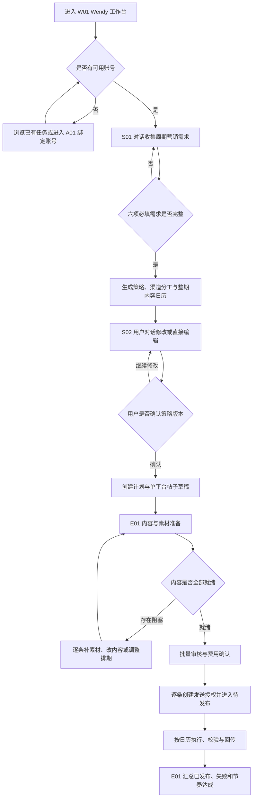
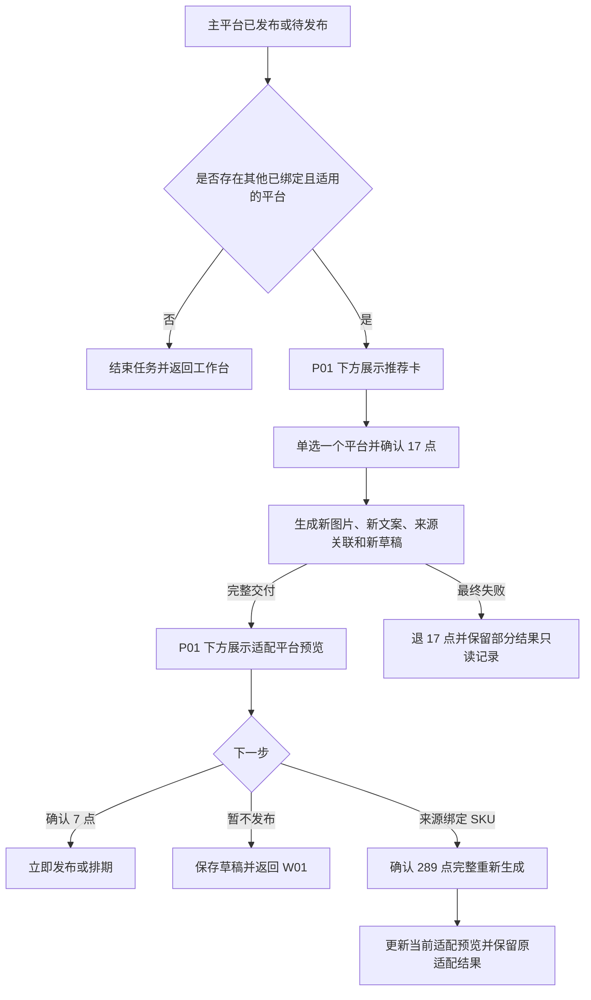
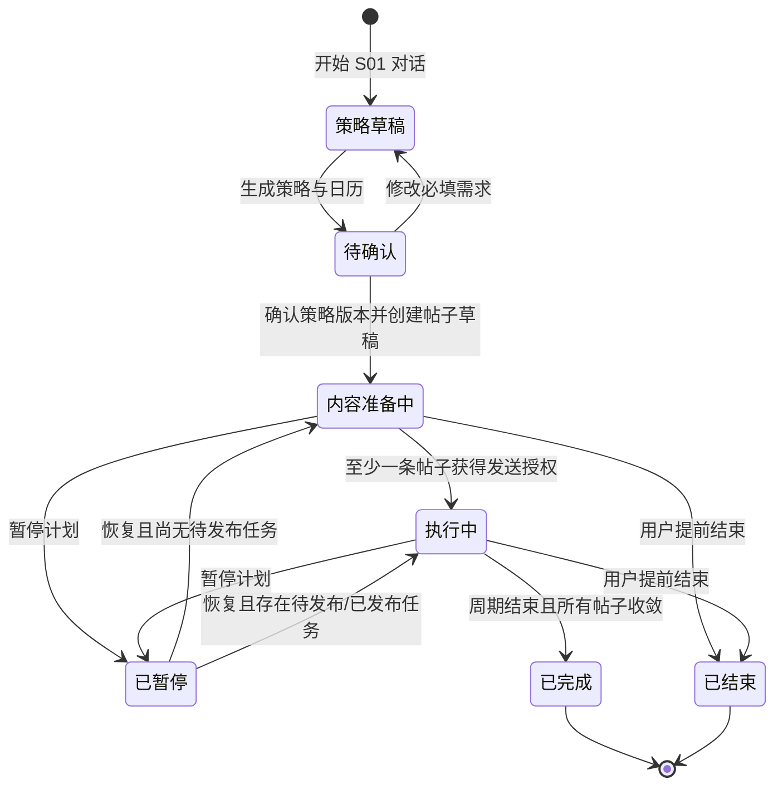
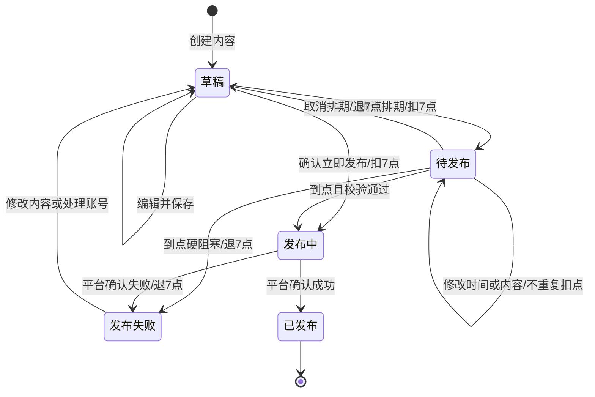

# Wendy 周期社媒运营与发布 PRD

## 1. 文档信息

- 产品：OntoZ 工作台
- 所属模块：社媒运营 Wendy
- 版本：V2.0
- 文档状态：待评审
- 更新日期：2026-08-25
- 参考资料：[社媒 Wendy 旅程、字段与状态机](https://iihcw7mp26x.feishu.cn/wiki/ZHXxwws9ViOntRkUEBQcKPmqnQd?from=from_copylink)
- 原型范围：本地 `#wendy`、`#wendy/accounts`、`#wendy/agent` 单篇发布交互原型
- 本次新增：周期营销策略对话、多平台内容计划、批量内容准备和计划执行中心
- 输出目的：统一产品、设计、研发和测试对 Wendy V2.0 目标流程的理解

## 2. 结论先行

Wendy V2.0 的核心运营单元由“单篇帖子”升级为“周期营销计划”。用户先通过对话说明本周期要达成什么目标，Wendy 再一次性规划一周、一个自然月或自定义时间段内的多平台内容，包括图文、纯文和视频帖子。用户确认完整策略与内容日历后，系统才创建帖子任务并进入内容生成、审核、排期和发布流程。

产品提供三类入口：

1. `制定运营计划`：新版主入口。通过对话收集周期、目标、主推产品、内容方向、社媒渠道和发布节奏，生成可确认的周期策略与多平台内容日历。
2. `AI 生成单篇`：保留单篇应急内容入口，复用 G01-G03。
3. `快速发布`：保留纯文、已有图片或视频的临时发布入口，复用 M01。

周期计划与帖子任务采用两层模型：

- 计划层负责策略、周期、渠道组合、内容方向、节奏、日历、整体进度与成本预估。
- 帖子层仍保持“一条帖子对应一个平台和一个账号”，独立生成素材、合规校验、获得发送授权并记录发布结果。

本地旧原型仅用于复用日历、AI Flow、内容编辑和平台预览的视觉交互，不作为新版业务规则的最终依据。本期按以下决策收敛：

- 策略通过自然语言对话逐步收集，不要求用户一次填写长表单。
- 系统只有在六项必填需求完整后才生成策略；有歧义时继续追问。
- 策略输出必须同时包含整体营销逻辑和逐条内容日历，不能只给概念性建议。
- 用户确认策略后创建计划版本和帖子草稿，但不自动公开发帖、不自动扣除发布点数。
- 多平台计划可以包含多个帖子；每条帖子仍是独立平台任务，拥有自己的状态、素材、合规结果和 7 点发布授权。
- 计划内可批量生成内容、批量审核和批量确认排期；系统必须逐条展示费用、阻塞项和执行结果。
- 289 点、17 点和 7 点仍是独立交付或执行；策略草稿和策略确认本身暂不扣点。
- 未绑定或不可用的平台可以出现在“建议绑定”中，但不能进入已确认的可执行计划；用户需绑定或移除后才能确认。
- 成功生成的 AI 图片和关联文案自动保存到企业知识库 AI 资产库，Wendy 不新建独立素材库。

## 3. 背景与现状问题

### 3.1 用户问题

- 外贸企业缺少稳定的海外社媒运营人员，内容准备、平台适配和排期发布分散在多个工具中。
- 旧版一次只解决一篇内容，用户仍需自行决定未来几周发什么、在哪个平台发以及如何保持节奏。
- 多平台内容之间缺少统一营销目标和主题编排，容易重复发帖、内容断层或渠道定位混乱。
- 企业产品事实、认证和卖点没有统一来源，AI 生成内容容易出现事实偏差。
- 发布失败、授权失效或生成中断后，用户难以找回原任务并判断是否已扣点或退款。
- 同一内容拓展到其他平台时，用户需要重新整理图片、文案和发布时间，重复成本高。

### 3.2 当前原型问题

- 旧原型从“AI 生成/快速发布”直接进入单篇内容，没有营销周期、渠道组合、内容方向和频次的规划层。
- 日历只用于查看既有帖子，不能先生成一整个周期的草案并批量调整。
- AI 流程默认选中 LinkedIn、SKU 和视觉风格，不符合“用户确认后再创建任务”的门禁要求。
- “生成方案”后又要求用户编辑营销方案、图片比例、语言和海报必含信息，输入层级过多，并与 SKU 作为事实来源的原则冲突。
- 生成结果卡直接提供发布时间和“发布”，缺少独立预览、合规校验、7 点确认和发布结果状态。
- 快速发布在弹窗中完成所有动作，难以承载发布失败、排期修改、任务恢复和跨平台推荐。
- 原型把其他平台处理表达为免费“同步发送”，与单平台任务和 17 点适配交付冲突。
- 列表存在“当前待发”和通用删除操作，与 V2.0 的五态模型及历史发布永久保留规则冲突。
- 账号管理仅展示授权/未授权，缺少账号名、失效原因、重新授权和受影响任务说明。

## 4. 产品目标与成功指标

### 4.1 产品目标

1. 让用户通过对话完成周期营销需求梳理，不需要先掌握专业内容策略方法。
2. 一次性生成覆盖整个周期、多平台和多内容形式的可执行发布计划。
3. 让用户在任何内容生产和发布动作发生前，先确认营销策略、节奏、日历和成本预估。
4. 让计划内每条内容基于企业知识库事实执行，同时保留单篇编辑和平台适配能力。
5. 支持批量准备、批量审核和批量排期，并对异常帖子提供逐条处理和恢复。
6. 让生成、适配和发布具备明确的交付边界、任务状态和退款口径。

### 4.2 核心指标

V2.0 先建立基线，不在缺少真实流量数据时承诺绝对目标值。

| 指标 | 定义 |
| --- | --- |
| 策略需求收集完成率 | 进入 S01 的用户中，完成六项必填需求并生成策略的比例 |
| 策略确认率 | 生成 S02 策略后，确认任一策略版本的比例 |
| 平均策略修订轮次 | 从首次生成到最终确认发生的对话或直接编辑次数 |
| 周期计划覆盖率 | 已确认计划中，拥有明确平台、形式、主题和时间的内容槽位比例 |
| 内容准备完成率 | 已确认计划中，在发送前达到“内容就绪”的帖子比例 |
| 计划按时执行率 | 计划排期帖子中，在目标时间窗口成功发布的比例 |
| 发布节奏达成率 | 实际发布篇数与计划篇数的比值，按周和平台计算 |
| 内容创建完成率 | 进入 G01 或 M01 的用户中，到达 P01 的比例 |
| AI 完整交付率 | 289 点任务中，图片和文案共同完整交付的比例 |
| 首次发布成功率 | 扣除 7 点后，首次执行进入已发布的比例 |
| 排期成功执行率 | 待发布任务中，到点后成功发布的比例 |
| 任务找回成功率 | 从 W01 打开未完成任务后，恢复到正确页面和状态的比例 |
| 其他平台适配采用率 | 出现推荐模块的任务中，确认 17 点适配的比例 |
| 适配后发布率 | 17 点完整交付后，继续发布或排期的比例 |
| 重复扣点率 | 同一幂等业务操作产生重复扣点的比例，目标为 0 |

## 5. 目标用户与用户故事

| 用户 | 核心任务 |
| --- | --- |
| 外贸企业主 | 用较少操作生成产品内容并完成发布或排期 |
| 市场运营人员 | 制定周期策略，基于 SKU 批量产出可信内容 |
| 内容运营人员 | 管理整期日历、素材准备、排期与失败任务 |
| 运营负责人 | 审核营销策略、渠道节奏、成本和执行进度 |

关键用户故事：

- 作为企业主，我希望用对话说明目标和周期，就能获得一份完整、可执行的社媒计划。
- 作为运营负责人，我希望在执行前看到一周或一个月内每条帖子的渠道、主题、产品、形式和时间。
- 作为市场运营人员，我希望同一营销目标能拆成适合 LinkedIn、Instagram、TikTok 和 YouTube Shorts 的不同内容。
- 作为内容运营人员，我希望批量生成和排期整期内容，同时单独处理缺素材或校验失败的帖子。
- 作为运营人员，我希望选择一个企业 SKU 后直接生成可发布图文，不需要重复录入产品事实。
- 作为运营人员，我希望在扣点前看清交付内容和费用，避免不知道购买了什么。
- 作为内容运营人员，我希望刷新、离开或断网后仍能从列表找回生成或适配任务。
- 作为账号管理员，我希望知道哪个账号需要重新授权，以及会影响哪些待发布任务。
- 作为运营负责人，我希望已发布记录永久可追溯，失败任务有明确原因和退点状态。
- 作为多平台运营人员，我希望主平台完成后再选择一个合适平台做付费适配，而不是一次生成不可控的多平台任务。

## 6. 产品范围

### 6.1 平台与内容能力

| 平台 | 纯文 | AI 海报 | 已有图片 | 已有视频 | 平台文案 |
| --- | --- | --- | --- | --- | --- |
| LinkedIn | 支持 | 支持 | 支持 | 支持 | 支持 |
| Instagram | 不支持 | 支持 | 支持 | 支持 | 支持 |
| TikTok | 不支持 | 不支持 | 不支持 | 支持 | 支持 |
| YouTube Shorts | 不支持 | 不支持 | 不支持 | 支持 | 支持 |

平台最终是否可选，以正式环境账号授权、连接器能力和验收结果为准。平台未配置或能力未通过验收时，展示不可用原因，不允许创建任务。

### 6.2 本期包含

- 周、一自然月和自定义时间段的周期营销计划。
- 对话式需求收集：周期、目标、主推产品、内容方向、社媒渠道和发布节奏。
- AI 营销策略、渠道角色、内容支柱、内容形式组合和完整发布日历。
- 计划内纯文、图文和已有视频三类帖子，以及对应的平台能力校验。
- 策略版本确认、计划级编辑、帖子级编辑、批量内容准备和批量排期。
- Wendy 工作台及计划、周、月、列表四类运营视图。
- LinkedIn、Instagram、TikTok、YouTube Shorts 账号管理。
- AI 生成输入、生成进度、图文结果编辑、最多 8 次成功 AI 改图。
- 快速发布的一篇纯文、一张已有图片或一个已有视频，以及平台文案和免费文案辅助。
- 独立平台预览与发布页、合规检查、立即发布、定时发布和结果状态。
- 草稿、待发布、发布中、已发布、发布失败五种发布任务状态。
- 289 点完整生成、17 点其他平台适配、7 点发布或排期及对应退点规则。
- 成功 AI 结果自动保存至企业知识库 AI 资产库。

### 6.3 本期不包含

- 超过当前自定义周期上限的全年或永久自动运营计划。
- 系统未经用户确认自动修改策略、自动补充预算或自动公开发帖。
- AI 视频生成、剪辑或加工。
- 轮播帖、多图帖和图片视频混合帖子。
- 完整海报编辑器、复杂图层或设计模板编辑。
- 单条 AI 帖子中的本地产品资料上传、临时事实输入和多 SKU 组合。
- 独立 Wendy 素材库、AI 内容库、草稿箱或内容管理中心。
- PDF、Word、PPT、Excel 等文件解析。
- 广告 Campaign、投放预算和付费广告效果优化。

## 7. 核心产品原则

### 7.1 计划多平台、帖子单平台

- 一个营销计划可包含多个平台、多个产品和多条内容。
- 每个内容槽位最终拆成一条单平台帖子任务，对应一个平台和一个发布账号。
- 同一主题跨平台复用时，用 `content_group_id` 关联多个平台任务，但文案、素材规格、状态和发布授权分别管理。
- 目标平台或账号需要变化时，创建或替换对应帖子任务；已获得发送授权的任务不能直接换平台或账号。

### 7.2 企业知识库是 AI 事实源

- 计划层可以选择一个或多个主推 SKU；每个帖子任务最多绑定一个主要 SKU。
- Wendy 读取所选 SKU 的当前事实和全部可用产品图片，不在页面拆分编辑 SKU 字段。
- 确认 289 点时保存 SKU 资料快照；任务创建后不随知识库更新自动变化。
- 参考图只定义视觉方向，不作为产品图、品牌信息或产品事实来源。
- 没有可用 SKU 时，用户可从 S01 或 G01 前往企业知识库上传，返回后刷新 SKU 列表。

### 7.3 先交付内容，再授权发送

- 策略确认只冻结计划版本并创建帖子草稿，不代表内容生成扣点或平台发送授权。
- 289 点购买图文生成包，不代表发送授权。
- 17 点购买一个新平台的适配结果，不代表发送授权。
- 7 点用于一个平台的一次立即发布或排期授权。
- 只有内容完整、账号可用、合规检查满足条件时，才开放 7 点操作。

### 7.4 先确认整期策略，再执行帖子

- 必填需求不完整时，Wendy 继续对话，不生成看似完整但无法执行的策略。
- S02 必须同时展示策略摘要、渠道分工、内容方向、完整日历、素材需求和成本预估。
- 用户确认某一策略版本后，系统按该版本创建帖子草稿；之后的重大调整形成新版本并保留变更记录。
- 计划确认后仍允许调整未发布帖子；已发布记录不可回写或覆盖。
- 计划级批量操作只能处理满足条件的帖子，阻塞帖子必须明确排除并说明原因。

### 7.5 任务可恢复、扣点可追溯

- 页面刷新或离开不改变任务状态。
- 所有已扣点任务都必须有可恢复的任务记录。
- 内容交付状态、发布状态和点数状态独立记录并分别展示。
- 重复点击、刷新和网络重试不能创建重复任务或重复扣点。

## 8. 信息架构与页面地图

| 编号 | 页面/视图 | 建议路由 | 核心任务 |
| --- | --- | --- | --- |
| W01 | Wendy 工作台 | `#wendy` | 查看计划、日历和任务，进入周期或单篇创建 |
| A01 | 账号管理 | `#wendy/accounts` | 绑定、解绑、重新授权和查看可用性 |
| S01 | 策略需求对话 | `#wendy/plan/new` | 通过对话收集六项必填需求并形成结构化 Brief |
| S02 | 策略与日历确认 | `#wendy/plan/:planId/review` | 查看、修改和确认营销策略及整期内容日历 |
| E01 | 计划执行中心 | `#wendy/plan/:planId` | 批量准备、审核、排期并跟踪整期执行 |
| G01 | AI 生成输入 | `#wendy/ai` | 完成四项输入并确认 289 点 |
| G02 | 生成进度 | `#wendy/ai/:taskId/progress` | 查看图文交付进度和失败恢复 |
| G03 | 生成结果编辑 | `#wendy/ai/:taskId/edit` | 选择海报、改图、编辑文案 |
| M01 | 快速发布 | `#wendy/quick` | 使用已有素材准备单平台内容 |
| P01 | 平台预览与发布页 | `#wendy/post/:taskId` | 最终预览、合规、发布、排期、结果和其他平台适配 |

S01-S02-E01 是新版主流程；G01-G03、M01 和 P01 是计划内每条帖子的执行子流程，同时保留为单篇应急入口。页面编号只用于内部协作，不进入用户界面。路由为产品语义建议，实际参数结构由研发评审确定。

## 9. 整体用户流程

### 9.1 周期计划主流程

### 9.2 策略对话收集流程

Wendy 在 S01 通过对话收集以下六项必填需求，用户可以任意顺序表达，系统负责抽取并回填结构化 Brief：

| 需求维度 | 必填 | 产品定义 |
| --- | --- | --- |
| 运营周期 | 是 | 一周、一个自然月或自定义开始/结束日期 |
| 营销目标 | 是 | 品牌认知、产品推广、获客、活动预热、内容教育等，可多选并明确主目标 |
| 主推产品 | 是 | 从企业知识库选择一个或多个 SKU；品牌型计划可选择“企业品牌” |
| 内容方向 | 是 | 本周期希望重点表达的主题、卖点、场景、案例或活动 |
| 社媒渠道 | 是 | 一个或多个已绑定且可用的平台与账号 |
| 发布节奏 | 是 | 每周总篇数，并展示各平台分配；例如每周 5 篇 |

推荐补充信息包括目标受众、目标市场、内容语言、关键日期、已有素材、禁用表达、CTA 和审批人。补充项缺失不阻塞策略生成，但 Wendy 可在明显影响结果时追问。

对话规则：

1. 首轮允许用户一次描述全部需求，也允许只说“帮我规划下个月的新品内容”。
2. Wendy 解析已知信息，在对话侧边或顶部持续展示 Brief 完成度。
3. 每轮只追问当前最关键的一至两个缺失项，避免变成长表单问卷。
4. 对模糊表达先给出可确认的解释，例如“每周 5 篇，是所有平台合计还是每个平台 5 篇？”
5. 渠道未绑定时，标记为“待绑定”，提供 A01 入口；用户绑定或移除该渠道前不能确认执行计划。
6. 主推产品必须关联知识库 SKU；计划层允许多 SKU，但每条帖子只绑定一个主要 SKU。
7. 用户可随时说“修改周期/去掉 TikTok/把频次改为每周 3 篇”，系统更新结构化 Brief 并展示变更。
8. 六项必填信息完整后才开放“生成营销策略”。

### 9.3 策略生成、修改与确认

S02 输出由六部分组成：

1. 策略摘要：周期、主目标、目标受众/市场、核心信息和成功指标。
2. 渠道分工：每个平台的角色、内容形式、账号和每周频次。
3. 内容支柱：3-6 个内容方向，以及与主推 SKU、营销目标的映射。
4. 内容组合：纯文、图文、视频的数量与比例；标记需要新生成或用户补充的素材。
5. 完整日历：周期内每一条帖子的日期时间、平台、主题、产品、形式、目标和内容 Brief。
6. 执行预估：帖子数量、AI 生成/平台适配数量、待补素材数量、发布授权数量和预计点数。

用户可以通过两种方式修改：

- 对话修改：例如“第一周减少产品硬广，多加两篇行业教育内容”。
- 直接编辑：调整日历槽位、拖动日期、修改平台、主题、产品、形式和时间。

每次重新生成或重大调整形成新的策略版本。确认页展示相对上一版的新增、删除和移动数量。主按钮为“确认此策略并创建计划”，确认后：

- 冻结当前策略版本并创建计划记录。
- 为日历内每个槽位创建单平台帖子草稿。
- 不自动创建付费生成任务，不扣 289/17/7 点，不自动公开发布。
- 进入 E01，由用户确认批量内容准备和后续发送授权。

### 9.4 计划执行流程

1. E01 按时间和平台展示所有帖子草稿，并汇总“待准备、生成中、待审核、可排期、待发布、已发布、失败”。
2. 系统根据内容形式和素材来源为每条帖子确定执行路径：
   - AI 独立生成图文：进入 G01-G03，或由计划批量提交同等任务。
   - 从同一内容组适配图片到新平台：使用 17 点适配路径。
   - 使用已有图片/视频：进入 M01 或计划内快速编辑。
   - 纯文：生成或编辑平台文案，不创建图片生成任务。
3. 用户选择若干可执行帖子，查看逐条费用和总费用后批量确认内容准备。
4. 系统并发创建独立子任务；某条失败不影响其他任务继续。
5. 内容就绪后，用户逐条预览，或进入计划级批量审核。
6. 批量排期前，系统逐条执行账号、素材、文案、时间和合规门禁。
7. 用户看到可排期数量、阻塞数量、每条 7 点和总点数后，一次确认；后台仍为每条帖子创建独立发送授权和交易记录。
8. 阻塞帖子保留为草稿，不纳入本次扣点和排期。
9. E01 持续汇总发布结果和每周节奏达成情况。

### 9.5 单篇 AI 生成子流程

计划内帖子可从 E01 进入；用户也可以从 W01 点击“AI 生成单篇”创建临时内容。

1. 用户进入 G01。
2. G01 默认不选择平台、SKU 或视觉方案。
3. 用户完成四项输入：目标平台、发布目标、一个 SKU、一个视觉方案。
4. 主按钮明确显示“消耗 289 点并生成”。
5. 系统完成账号、能力、输入、SKU 和余额门禁后，创建生成任务、扣点并保存 SKU 快照。
6. G02 同时展示图片和文案两项进度；任一未完成时保持处理中。
7. 两项均可用后进入 G03；成功结果自动写入 AI 资产库。
8. 用户选择海报、编辑文案、轻量编辑或提交 AI 改图要求。
9. 点击“继续发布”进入 P01，生成任务本身仍保留为内容草稿。

### 9.6 快速发布子流程

计划内纯文或已有素材帖子可从 E01 进入；用户也可以从 W01 点击“快速发布”创建计划外临时内容。

1. 用户进入 M01。
2. M01 选择一个已绑定且支持当前内容形式的平台与账号。
3. 选择纯文，或添加一张已有图片/一个已有视频；上传素材后由系统识别图片或视频类型。
4. 填写平台文案，或使用免费改写、翻译、补标签等文案辅助。
5. 用户可以保存草稿并返回 W01，也可以在内容完整后进入 P01。
6. 快速发布不触发 AI 图片生成，不消耗 289 点。

### 9.7 其他平台适配流程

计划内同一主题的多平台帖子优先在 S02 阶段规划并通过 `content_group_id` 关联。P01 的发布后推荐只用于临时扩展或计划外新增平台。

推荐约束：

- 立即发布需进入已发布后才展示推荐；发布中不展示。
- 待发布任务可以立即展示推荐。
- 只推荐其他已绑定、当前可用且支持图片发布的平台。
- 最终素材为视频时不展示 V2.0 图片适配推荐。
- 每次只确认一个平台；完成后可以继续检查剩余候选平台。

## 10. 页面详细需求

### 10.1 W01 Wendy 工作台

页面目标：查看周期计划、发布日历和任务状态，并进入周期或单篇内容创建。

**页面结构**

1. 顶部欢迎区：主操作“制定运营计划”，次操作“AI 生成单篇”“快速发布”。
2. 账号摘要：已绑定数量、异常数量、账号管理入口。
3. 当前计划摘要：计划名称、周期、目标、完成进度、下一条待处理内容和“进入计划”操作。
4. 内容视图：计划、周、月、列表。
5. 筛选与空状态。

**视图规则**

| 视图 | 展示任务 | 主要字段 |
| --- | --- | --- |
| 计划视图 | 草稿、待确认、准备中、执行中、已暂停、已完成的周期计划 | 周期、目标、渠道、计划篇数、就绪/排期/发布进度、当前风险 |
| 周视图 | 待发布、已发布 | 时间、平台、账号、内容摘要、状态 |
| 月视图 | 待发布、已发布 | 日期、平台、内容摘要、状态 |
| 列表视图 | 草稿、待发布、已发布、发布失败 | 状态、平台、账号、缩略图/文案摘要、状态对应时间、操作 |

列表的“状态对应时间”统一为：

- 草稿：最后编辑时间。
- 待发布：排期时间。
- 已发布：实际发布时间。
- 发布失败：失败确认时间。

**任务打开规则**

| 任务情况 | 打开页面 |
| --- | --- |
| 289 点处理中或退款后的部分结果 | G02 |
| 289 点完整交付、尚未发布 | G03 或最近停留的 P01 |
| 快速发布草稿 | M01 或最近停留的 P01 |
| 17 点处理中、完成或失败 | P01 的适配模块 |
| 待发布、已发布、发布失败 | P01 |

**业务规则**

- 未绑定账号时仍可进入 S01 描述需求和查看渠道建议，但包含未绑定渠道的策略不能确认执行。
- W01 默认优先展示正在执行的计划；没有计划时展示“制定第一个运营计划”引导。
- 周/月视图同时展示计划内和计划外帖子，并用计划名称或“临时内容”标识来源。
- 同一帖子在计划、日历和列表视图中只对应一条任务记录。
- 已发布历史永久保留且只读，不提供删除。
- 草稿和发布失败只从列表视图进入。
- 发布中只在当前发送流程短暂出现，不进入长期列表。
- V2.0 不提供通用任务删除；取消排期按状态机回到草稿。

### 10.2 A01 账号管理

页面目标：查看四个平台账号并完成绑定、解绑或重新授权。

每个平台至少展示：

- 平台图标与名称。
- 账号显示名或 `@账号`。
- 授权状态：已绑定、未绑定、授权失效、平台暂不可用。
- 当前内容能力：图片、视频、发布或排期是否可用。
- 唯一主操作：去绑定、解绑、重新授权或暂不可用。

账号规则：

- 解绑不删除已发布记录。
- 解绑会影响待发布任务时，确认卡列出任务数量和点数处理。
- 受解绑影响的待发布任务取消发送授权，退回 7 点并回到可编辑草稿。
- 已进入发布中的任务继续收敛为已发布或发布失败。
- 重新授权后由用户手动恢复原任务，不自动发送。

### 10.3 S01 策略需求对话

页面目标：通过自然语言对话收集一整个周期的营销需求，并让用户随时看见系统已理解的内容。

**页面结构**

1. 顶栏：返回 Wendy、临时计划名称、保存并退出。
2. 对话主区：用户消息、Wendy 追问、快捷选项和知识库选择卡。
3. Brief 摘要区：六项必填需求、补充信息、完成度和冲突提示。
4. 底部输入区：文本输入、语音转文字入口预留、上传参考资料入口预留。
5. 主操作：六项完整后显示“生成营销策略”。

**必填需求字段**

| 字段 | 输入方式 | 规则 |
| --- | --- | --- |
| 运营周期 | 对话解析/日期选择 | 一周、自然月或自定义开始/结束日期 |
| 营销目标 | 对话解析/多选 | 允许多个目标，但必须确认一个主目标 |
| 主推产品 | 对话解析/SKU 选择 | 一个或多个知识库 SKU，或“企业品牌” |
| 内容方向 | 对话解析/标签与自由文本 | 至少一个，可由 Wendy 基于目标和 SKU 建议 |
| 社媒渠道 | 对话解析/账号选择 | 一个或多个渠道，每个渠道关联具体账号 |
| 发布节奏 | 对话解析/数值编辑 | 至少明确“所有平台合计每周 X 篇”；可进一步按平台分配 |

**周期规则**

- 一周：连续 7 天，用户确认开始日期；系统可以建议从下周一开始，但不能静默代选。
- 一个月：一个自然月，用户确认月份和时区。
- 自定义：用户选择开始和结束日期，开始时间不得晚于结束时间。
- V2.0 建议自定义周期最长 90 天，最终上限由任务容量和商业策略评审确认。
- `计划周数 = ceil(周期总天数 / 7)`；系统据此计算建议篇数，但 S02 必须展示实际总篇数并由用户最终确认。

**对话与抽取规则**

- 用户一次提供多项信息时，系统同时更新多个 Brief 字段，不重复追问。
- 用户表达和结构化字段冲突时，以最近一次明确表达为准，并在摘要中标记变更。
- 用户只说“每周 5 篇”时，默认解释为所有渠道合计，并追问或建议各平台分配。
- Wendy 可以根据目标和产品建议内容方向，但建议项必须由用户接受或修改。
- 用户选择多个 SKU 时，允许定义主次优先级；没有优先级时在 S02 生成前追问。
- 渠道未绑定或能力不满足时，在 Brief 中显示阻塞，不删除用户的原始意图。
- 会话自动保存为策略草稿，刷新后恢复最近一条消息和 Brief 状态。

**生成门禁**

- 六项必填需求全部明确。
- 日期合法且时区明确。
- 发布节奏为正整数并能计算计划总篇数。
- 至少一个渠道已绑定且具备发布能力。
- 至少一个 SKU 可用，或计划明确为企业品牌内容。

### 10.4 S02 策略与日历确认

页面目标：把对话结果转成可以执行的营销策略和逐条内容日历，让用户确认后再创建任务。

**页面模块**

| 模块 | 主要内容 | 用户操作 |
| --- | --- | --- |
| 策略总览 | 周期、主目标、受众/市场、主推产品、核心信息、KPI | 对话修改、直接编辑 |
| 渠道策略 | 各平台角色、账号、每周频次、主要内容形式 | 调整渠道、频次和形式 |
| 内容支柱 | 内容方向、目标映射、SKU 映射和建议占比 | 增删、重命名、调整占比 |
| 内容组合 | 纯文/图文/视频数量、新生成/适配/已有素材数量 | 调整形式或素材来源 |
| 发布日历 | 每一条内容槽位 | 编辑、复制、删除、拖动、重新生成局部计划 |
| 执行预估 | 总篇数、待补素材、预计生成与发布点数、阻塞项 | 查看明细、处理阻塞 |

**内容槽位字段**

| 字段 | 必填 | 说明 |
| --- | --- | --- |
| 发布日期和时间 | 是 | 使用计划时区，必须位于周期内 |
| 平台与账号 | 是 | 单平台、单账号 |
| 内容形式 | 是 | 纯文、图文或视频 |
| 营销目标 | 是 | 继承计划目标，可指定当前帖子的子目标 |
| 内容方向 | 是 | 关联一个内容支柱 |
| 主推对象 | 条件必填 | 关联一个 SKU 或企业品牌 |
| 内容主题/标题 | 是 | 用一句话说明这条帖子讲什么 |
| 内容 Brief | 是 | 核心信息、场景、证据、CTA 和语气要求 |
| 素材来源 | 是 | AI 独立生成、跨平台适配、已有素材、待用户补充 |
| 内容组 | 否 | 同主题跨平台帖子使用同一 `content_group_id` |
| 状态 | 系统 | 规划中、待准备、阻塞等 |

**日历生成与校验规则**

- 计划总篇数必须与用户确认的节奏相符；存在偏差时明确展示原因。
- 系统按照渠道角色和用户频次分配帖子，不能把“每周 X 篇”重复应用到每个平台。
- 同一平台同一时间不能安排两条帖子；跨平台同主题可同日但需要平台化表达。
- 内容方向和产品分布避免连续重复；确需集中发布时在策略说明中解释。
- 视频槽位在 V2.0 只能使用已有视频或标记“待用户补充”，不能承诺 AI 生成视频。
- 未绑定账号、SKU 不可用、素材缺失或平台不支持当前形式时，槽位显示硬阻塞。
- Wendy 支持只重新规划选中的某一周、某个平台或某个内容支柱，不强制覆盖整份计划。
- 直接编辑日历后，策略摘要和执行预估实时重算。

**版本与确认规则**

- 首次生成记为 V1；整体重新生成、周期变化、渠道增删或频次变化产生新版本。
- 文案微调、单条时间移动和主题重命名记录变更，但不强制提升主版本号。
- 用户可以查看上一版本和差异，不提供把已发布事实回滚到旧计划的能力。
- 硬阻塞未处理时不能确认；软风险允许用户知情后确认。
- 主操作显示“确认此策略并创建 N 条帖子草稿”。
- 确认时不扣 289/17/7 点；成功后进入 E01。

### 10.5 E01 计划执行中心

页面目标：把已确认策略转化为可批量准备、审核、排期和追踪的整期执行工作台。

**页面结构**

1. 计划头部：名称、周期、当前策略版本、目标、渠道、计划状态和整体进度。
2. 进度漏斗：总计划、待准备、生成中、待审核、可排期、待发布、已发布、失败。
3. 日历/列表切换：默认日历，可按平台、内容形式、产品、内容方向和状态筛选。
4. 帖子详情抽屉：内容 Brief、素材、文案、费用、合规和操作记录。
5. 批量操作栏：准备内容、送审、确认排期、暂停未来发送。
6. 风险区：账号失效、缺素材、余额不足、时间冲突和失败任务。

**批量内容准备**

- 用户勾选待准备帖子后，系统按执行路径分组：289 点独立图文、17 点平台适配、已有素材/纯文和待补视频。
- 确认页逐条展示平台、日期、内容形式、生成路径和点数，并显示可执行总数与总点数。
- 待补素材、账号不可用或余额不足的帖子不纳入提交，也不扣点。
- 批量提交后每条帖子创建独立任务、幂等键和交易；部分失败不回滚已成功创建的其他任务。
- 内容生成完成后进入待审核；生成失败按原 289/17 点规则退款。

**批量审核与排期**

- 支持按周或筛选结果批量审核，不要求一次审核整个周期。
- 用户必须能打开任一帖子查看原生平台预览和合规结果。
- 批量排期确认页展示可排期 N 条、阻塞 M 条、逐条 7 点和总点数。
- 用户一次确认后，后台为可排期帖子分别扣 7 点、创建发送授权并进入待发布。
- 任一帖子扣点或授权失败只影响该帖子；最终结果页逐条展示成功、失败和未处理原因。
- 计划执行中允许调整尚未获得发送授权的帖子；已待发布帖子沿用 P01 修改与退点规则。

**计划级操作**

- 修改策略：回到 S02 创建新版本，仅影响未发布帖子。
- 暂停计划：停止创建新的发送授权；已待发布任务由用户选择保留或逐条/批量取消。
- 恢复计划：重新检查账号、时间、素材和余额，不自动补发错过时间的帖子。
- 结束计划：停止未来内容准备，保留所有历史任务和执行数据。
- 查看复盘：V2.0 只展示计划完成度和发布结果，不包含深度效果归因。

### 10.6 G01 AI 生成输入

页面目标：在一个页面完成四项输入和 289 点确认。

| 字段 | 类型 | 必填 | 规则 |
| --- | --- | --- | --- |
| 目标平台 | 单选 | 是 | 只展示已绑定、可用且支持 AI 海报的平台 |
| 发布目标 | 多行文本 | 是 | 描述传播目标，最多 360 字；计划内任务从内容 Brief 预填 |
| 商品 SKU | 单选 | 是 | 来自企业知识库；展示名称、主图和次级图数量 |
| 视觉方案 | 单选 | 是 | 平台预设风格或一张参考图，二者互斥 |
| 生成费用 | 只读确认 | 是 | 主按钮显示“消耗 289 点并生成” |

G01 不展示以下独立字段：

- 图片比例。
- Post 语言。
- 海报必含信息清单。
- 目标受众、语言/市场、核心信息和 CTA。
- 独立营销方案或策略摘要。

以上内容由目标平台、发布目标、SKU 和视觉方案共同推导，并在生成结果中体现。用户需要修改时，通过发布目标、视觉方案、G03 文案编辑或 AI 改图完成。

视觉方案：

- LinkedIn 与 Instagram 分别展示 6 个预设方向，沿用原型的预览图、名称和一句话说明。
- 上传一张参考图后，自动切换到“参考图”视觉方案并取消预设风格选择。
- 参考图只显示缩略图，不出现独立分析页或提示词编辑。

来源规则：

- 从 W01 创建单篇时，平台、SKU 和视觉方案默认不选。
- 从 E01 打开计划内图文任务时，平台、账号、SKU、发布目标和建议视觉方案按已确认内容槽位预填。
- 计划预填字段允许在扣点前修改；平台、SKU 或内容方向变化时同步回写当前帖子草稿，但不自动改动其他计划帖子。

提交门禁：

- 四项输入完整。
- 目标账号当前可用。
- 所选 SKU 当前可用。
- 生成能力当前可用。
- 点数余额不少于 289。

只有系统成功创建任务时扣点。提交需使用幂等键，重复点击或网络重试不能重复创建任务。

### 10.7 G02 生成进度

页面目标：展示完整图文交付进度并支持任务恢复。

展示内容：

- 任务摘要：所属计划、计划版本、平台、账号、SKU、视觉方案、创建时间。
- 一个整体进度模块，内部显示“海报”和“平台文案”两项状态。
- 已完成项、待处理项和最近更新时间。
- 失败原因、退款状态和处理入口，仅在异常时出现。

规则：

- 图片或文案任一未完成时，任务保持处理中。
- 两项均可用后自动开放“查看并编辑结果”，进入 G03。
- 系统确认无法共同交付时进入交付失败，289 点进入退款处理中。
- 失败后的部分结果只读，不允许进入 G03 或 P01。
- 用户离开或刷新不终止任务；可从 W01 列表返回同一任务。

### 10.8 G03 生成结果编辑

页面目标：选择最终海报、调整文案并继续发布。

展示和操作：

- 当前海报与已有候选切换。
- 平台文案编辑：标题、正文、标签、CTA 按平台能力呈现。
- 免费文案辅助：改写、翻译、补标签、优化 CTA。
- 轻量图片编辑。
- AI 改图要求输入和提交。
- 保存草稿、返回计划执行中心、继续发布；计划外内容返回工作台。

AI 改图规则：

- 生成包最多包含 8 次成功改图。
- 只有成功产生新候选才计次；失败不计次。
- 原结果正在核对或改图正在收尾时，禁止重复提交。
- 剩余 3、2、1 次时提示余量；其余时间不常驻显示总权益。
- 成功改图自动保存到企业知识库 AI 资产库。

继续发布前再次检查目标账号可用性。账号不可用时保留内容并提供重新授权入口。

### 10.9 M01 快速发布

页面目标：使用纯文或已有素材完成一篇单平台内容。

| 字段 | 必填 | 规则 |
| --- | --- | --- |
| 目标平台与账号 | 是 | 单选一个已绑定且支持当前内容形式的平台 |
| 内容形式 | 是 | 选择纯文，或上传素材后由系统识别为图文/视频 |
| 已有素材 | 条件必填 | 图文需一张图片，视频需一个视频；纯文不展示素材字段 |
| 平台文案 | 是 | 平台所需标题、正文、标签和 CTA；不需要的项不显示 |

规则：

- 纯文由用户明确选择；上传素材时由系统识别图片/视频，不让用户手动标注素材类型。
- LinkedIn、Instagram 支持图片或视频；TikTok、YouTube Shorts 在 V2.0 只支持视频。
- 纯文只允许选择支持文本帖的平台；当前范围为 LinkedIn。
- 不展示 AI 海报生成、289 点或 8 次改图权益。
- 计划内任务从 S02 内容槽位预填平台、账号、时间、主题和内容 Brief；首次保存持续更新同一任务。
- 内容完整且账号可用时开放“继续预览”，进入 P01。
- M01 可沿用原型的编辑区和实时原生平台预览，但不在该页直接扣 7 点或结束发布。

### 10.10 P01 平台预览与发布页

页面目标：承载发送前最终确认、发布设置、执行结果和其他平台适配。

#### 10.10.1 最终预览

展示：

- 目标平台与账号，只读。
- 纯文帖展示无媒体的原生预览；图文/视频帖展示一张图片或一个视频的原生预览。
- 最终平台文案，只读。
- 内容来源：AI 生成、纯文、快速发布或平台适配。
- 所属计划、内容方向和计划时间；计划外内容显示“临时内容”。
- 发布检查结果。

内容需要修改时，按来源返回 G03、M01 或 P01 适配编辑模块；保存后回到同一 P01。目标平台和账号不能在原任务中更换。

#### 10.10.2 发布设置与确认

| 字段 | 规则 |
| --- | --- |
| 发布方式 | 立即发布/定时发布，二选一 |
| 发布时间 | 定时发布时必填，必须晚于当前时间 |
| 系统时区 | 与发布时间同区展示 |
| 发布检查 | 通过时简洁展示；有风险时展开 |
| 发布消耗 | 主按钮显示 7 点和具体动作 |

主操作文案：

- `消耗 7 点并立即发布`
- `消耗 7 点并确认排期`

点击主操作即完成确认、扣点和发送授权，不再追加二次确认卡。余额不足、账号失效、硬阻塞或时间无效时禁止提交。

计划内帖子可在 P01 单独确认 7 点，也可以返回 E01 参与批量排期。两种方式都为该帖子创建同一种独立发送授权，不能重复扣点。

#### 10.10.3 发布结果

| 状态 | 页面信息 | 用户动作 |
| --- | --- | --- |
| 发布中 | 正在发送，禁止重复操作 | 等待 |
| 待发布 | 排期时间、时区、内容摘要 | 改时间、改内容、取消排期、返回工作台 |
| 已发布 | 实际时间、最终内容、真实帖子链接 | 查看帖子、处理其他平台推荐、返回工作台 |
| 发布失败 | 失败原因、7 点退款状态、处理建议 | 修改内容、处理账号、重新确认、返回工作台 |

只有平台返回可验证帖子链接时才展示“查看平台帖子”。

#### 10.10.4 其他平台推荐与适配

推荐卡展示：

- 推荐平台与账号，单选。
- 有可靠依据时展示一行推荐原因。
- 明确说明 17 点交付新图片、新文案、来源关联和新草稿；后续发布另需 7 点。

计划已覆盖的目标平台不重复出现在推荐中。确认 17 点后，当前 P01 下方展示适配进度和结果，不跳转到新页面。完整交付后可：

- 确认 7 点立即发布或排期。
- 暂不发布，保存草稿并返回 W01。
- 来源绑定 SKU 时，确认 289 点完整重新生成。

## 11. 状态模型

### 11.1 五类状态独立记录

| 状态类型 | 回答的问题 | 状态值 |
| --- | --- | --- |
| 计划状态 | 整期策略和执行进行到哪一步 | 策略草稿、待确认、内容准备中、执行中、已暂停、已完成、已结束 |
| 帖子准备状态 | 该内容是否具备审核和发布条件 | 待准备、生成中、待审核、内容就绪、准备失败、阻塞 |
| 发布任务状态 | 内容是否已获得发送授权，执行到哪一步 | 草稿、待发布、发布中、已发布、发布失败 |
| 内容交付状态 | 289 点或 17 点约定内容是否完整 | 处理中、完整交付、交付失败 |
| 点数状态 | 当前消费是否扣除或退回 | 未扣点、已扣点、退款处理中、已退款 |

### 11.2 计划状态机

计划状态规则：

- “确认策略”只把计划推进到内容准备中，不等同于执行中。
- 至少一条帖子进入待发布或发布中后，计划进入执行中。
- 周期结束但仍有生成中、退款中或发布中任务时，计划保持执行中，直到任务收敛。
- 已暂停不自动取消已有待发布任务；暂停操作必须让用户选择保留还是取消未来发送授权。
- 已完成和已结束均只读保留；二者分别表示正常收敛和用户提前终止。

### 11.3 发布任务状态机

补充规则：

- 原型“当前待发”不作为 V2.0 独立状态；未执行前为待发布，开始发送后为发布中。
- 待发布任务修改内容或时间不重复扣 7 点，但后台和到点前必须重新校验。
- 取消排期后发送授权失效；再次发送需重新确认 7 点。
- 已发布内容永久只读。

### 11.4 289 点生成交付状态

| 状态 | 条件 | 用户动作 | 点数 |
| --- | --- | --- | --- |
| 处理中 | 任务已创建，图片或文案尚未共同完成 | 查看、离开、从 W01 返回 | 已扣点 |
| 完整交付 | 至少一张可用海报和一份平台文案均完成 | 编辑、改图、进入 P01 | 已扣点，不因主观不采用退款 |
| 交付失败 | 系统确认无法共同完成 | 查看部分结果和退款进度 | 退款处理中，最终退 289 点 |

### 11.5 17 点适配交付状态

| 状态 | 条件 | 用户动作 | 点数 |
| --- | --- | --- | --- |
| 处理中 | 适配任务已创建，四项交付尚未共同完成 | 查看、离开、从 W01 返回 P01 | 已扣点 |
| 完整交付 | 新图片、新文案、来源关联和新草稿均完成 | 发布、排期、暂不发布或完整重新生成 | 已扣点 |
| 交付失败 | 系统确认四项无法共同完成 | 查看部分结果和退款进度 | 退款处理中，最终退 17 点 |

## 12. 计费与退款

| 动作 | 消耗 | 确认位置 | 完整结果 |
| --- | --- | --- | --- |
| 策略对话与策略生成 | 免费 | S01/S02 | 一份可编辑策略与完整内容日历 |
| 确认策略并创建帖子草稿 | 免费 | S02 | 冻结策略版本并创建计划内帖子草稿 |
| AI 独立生成图文 | 289 点/帖子 | G01 或 E01 批量确认 | 一张可用海报候选、一份平台文案、最多 8 次成功改图 |
| AI 改图 | 生成包内 | G03 | 成功产生一个新候选才计次 |
| 立即发布 | 7 点/帖子 | P01 | 进入发布中并执行发送 |
| 定时发布 | 7 点/帖子 | P01 或 E01 批量确认 | 进入待发布并获得未来发送授权 |
| 计划内/计划外平台适配 | 17 点/目标帖子 | E01 或 P01 推荐卡 | 新图片、新文案、来源关联和新草稿 |
| 适配平台完整重生成 | 289 点 | P01 适配结果 | 基于原 SKU 重新生成目标平台图文 |
| 纯文或已有图片/视频的文案辅助 | 免费，商业口径待确认 | E01/G03/M01 | 生成或更新当前平台文案 |
| 轻量图片编辑 | 免费 | G03 | 更新当前海报结果 |

通用规则：

- 门禁不通过或任务未创建成功时不扣点。
- S02 在确认前展示整期预计费用，但费用只用于预算预估，不预扣点。
- E01 批量确认内容准备或排期时，必须同时展示逐条明细、可执行数量和总点数。
- 批量操作在交互上可以一次确认，账务上仍为每条帖子创建独立交易，以支持单条失败和退款。
- 同一业务动作使用幂等键，重试不重复扣点。
- 图片或文案部分完成时保持处理中，不立即退款。
- 289 点或 17 点最终交付失败时全额退回对应消费。
- 发布失败、取消排期或到点硬阻塞只处理该笔 7 点，不影响已完整交付的 289 点或 17 点。
- 退款状态和失败状态分开展示；同一消费不因多个失败原因重复退款。
- 修改未执行的计划槽位只更新预估，不对尚未创建的子任务扣点或退款。
- AI 视频生成不在 V2.0 范围内；视频槽位不会产生 AI 视频生成费用。

## 13. 合规与发布检查

### 13.1 计划确认阻塞

以下情况不允许在 S02 确认策略并创建可执行计划：

- 六项必填需求不完整或仍有关键歧义。
- 计划周期、时区或发布节奏无效。
- 实际帖子总数与用户确认的节奏不一致，且未解释偏差。
- 所有渠道均未绑定或不可用。
- 内容槽位缺少平台、形式、主题或时间。
- 视频槽位被错误标记为 AI 视频生成。
- 存在用户未确认的预计点数或内容数量变化。

单个渠道未绑定、单个素材缺失或部分 SKU 不可用时，可以保存和继续修改策略，但相关槽位标记为阻塞。只有用户移除阻塞槽位或完成处理后，才允许确认包含这些槽位的执行计划。

### 13.2 帖子发布硬阻塞

- 账号不可用或授权失效。
- 缺少平台必填文案或素材。
- 素材类型不受平台支持。
- 素材规格严重不符合平台要求。
- 明显违规内容。
- 排期时间无效。

硬阻塞时禁用 7 点主操作，并在具体问题旁提供“去修改内容”或“处理账号”。

### 13.3 帖子发布软风险

- 文案过长。
- 图片比例不是推荐规格。
- 标签不足。
- CTA 不清晰。
- 产品卖点证据不足。
- 平台语气不够适配。

软风险允许用户知情确认后继续。内容、素材、账号、平台能力或发布时间发生关键变化后，重新执行检查。

## 14. 异常处理

| 场景 | 页面反馈 | 下一步 |
| --- | --- | --- |
| 策略必填信息不完整 | Brief 标记缺失项，Wendy 继续追问 | 补充需求后再生成策略 |
| 发布节奏有歧义 | 展示系统的两种可能理解 | 用户确认总频次和平台分配 |
| 未绑定任何账号 | 保留工作台和历史任务；允许进入 S01，但策略不能确认执行 | 进入 A01 或移除渠道 |
| 策略生成失败 | 保留完整对话和 Brief，不生成空白日历 | 重试生成或保存退出 |
| 日历存在时间冲突 | 冲突槽位高亮并说明平台/时间 | 移动时间或重新规划局部日历 |
| 视频素材缺失 | 槽位标记“待补视频”，不承诺 AI 生成 | 上传或选择已有视频 |
| 批量创建部分失败 | 结果页逐条展示成功、失败和未提交 | 只重试失败项，不重复扣点 |
| 计划周期已开始但内容未就绪 | E01 显示逾期风险和受影响节奏 | 改期、取消该槽位或快速补充内容 |
| 授权失效 | 展示最后账号名、失效原因和受影响任务 | 重新授权后手动恢复 |
| 平台能力不可用 | 展示具体原因 | 选择其他平台或稍后重试 |
| 没有可用 SKU | S01/G01 SKU 空状态 | 前往企业知识库上传、改为品牌内容或返回刷新 |
| SKU 不可用 | 展示知识库返回的原因 | 更换 SKU 或去知识库处理 |
| 余额不足 | 展示余额和所需点数 | 充值或取消 |
| 生成部分成功 | 展示已完成项和待处理项 | 等待，不重复付费 |
| 改图结果核对中 | 展示“正在确认原生成结果” | 等待，不重复提交 |
| 改图收尾中 | 展示“正在结束本次改图” | 等待额度恢复 |
| 发布失败 | 失败原因和 7 点退款状态 | 修改或处理账号后重新确认 |
| 推荐适配不完整 | 处理中或退款处理中 | 等待或查看退款进展 |
| 无推荐平台 | 不展示推荐模块 | 结束流程 |

## 15. 核心数据对象

### 15.1 Strategy Brief

- `brief_id`
- `conversation_id`
- `period_type`：week/month/custom
- `start_date`、`end_date`、`timezone`
- `primary_goal`、`secondary_goals`
- `primary_sku_ids`、`brand_only`
- `content_directions`
- `channel_account_ids`
- `weekly_total_frequency`
- `channel_frequency_distribution`
- `audience`、`market`、`language`
- `key_dates`、`asset_constraints`、`prohibited_claims`、`cta_preferences`
- `required_field_completion`
- `blocking_reasons`
- `created_at`、`updated_at`

### 15.2 Marketing Plan

- `plan_id`
- `plan_name`
- `brief_id`
- `owner_id`
- `active_version_id`
- `confirmed_version_id`
- `status`：策略草稿/待确认/内容准备中/执行中/已暂停/已完成/已结束
- `start_date`、`end_date`、`timezone`
- `planned_post_count`
- `ready_post_count`、`scheduled_post_count`、`published_post_count`、`failed_post_count`
- `created_at`、`confirmed_at`、`updated_at`、`completed_at`

### 15.3 Plan Version

- `version_id`
- `plan_id`
- `version_number`
- `strategy_summary`
- `channel_strategy`
- `content_pillars`
- `content_mix`
- `success_metrics`
- `estimated_generation_points`
- `estimated_publish_points`
- `change_summary`
- `status`：draft/confirmed/superseded
- `created_by`、`created_at`、`confirmed_at`

### 15.4 Content Slot

- `slot_id`
- `plan_id`、`version_id`
- `content_group_id`，可为空
- `scheduled_at`、`timezone`
- `target_platform`、`account_id`
- `content_format`：text/image_text/video_text
- `goal`、`content_pillar_id`
- `sku_id`，品牌内容可为空
- `topic`、`content_brief`
- `asset_source_type`：ai_generate/adapt/existing/pending_user
- `preparation_status`
- `blocking_reasons`
- `task_id`，确认计划后创建
- `created_at`、`updated_at`

### 15.5 Content Task

- `task_id`
- `plan_id`、`slot_id`、`plan_version_id`，计划外内容可为空
- `source_type`：AI 生成/快速发布/平台适配/纯文
- `target_platform`
- `account_id`
- `sku_id`、`sku_snapshot_id`，品牌或快速发布可为空
- `publish_goal`
- `visual_plan_type`、`visual_plan_id`
- `asset_type`、`asset_ids`
- `platform_copy`
- `preparation_status`
- `content_delivery_status`
- `publish_status`
- `created_at`、`updated_at`

### 15.6 Publish Authorization

- `authorization_id`
- `plan_id`、`task_id`
- `batch_operation_id`，单篇确认可为空
- `mode`：立即发布/定时发布
- `scheduled_at`
- `timezone`
- `compliance_result_id`
- `points_transaction_id`
- `platform_request_id`
- `platform_post_url`

### 15.7 Points Transaction

- `transaction_id`
- `plan_id`、`task_id`
- `batch_operation_id`，可为空
- `action_type`：289 生成/17 适配/7 发布或排期
- `amount`
- `status`：已扣点/退款处理中/已退款
- `idempotency_key`
- `refund_reason`

### 15.8 Adaptation Relation

- `source_task_id`
- `target_task_id`
- `content_group_id`
- `target_platform`
- `adaptation_task_id`
- `original_adaptation_asset_ids`
- `regenerated_task_id`，可为空

## 16. 埋点需求

| 事件 | 关键属性 |
| --- | --- |
| `wendy_home_viewed` | 账号数量、默认视图、进行中计划数、未完成帖子数 |
| `wendy_create_entry_clicked` | 周期计划/AI 单篇/快速发布 |
| `wendy_strategy_conversation_started` | 入口、是否已有计划 |
| `wendy_strategy_brief_updated` | 被更新的字段、Brief 完成度、阻塞数 |
| `wendy_strategy_question_asked` | 缺失维度、问题轮次 |
| `wendy_strategy_generated` | 周期类型、渠道数、计划篇数、内容形式分布 |
| `wendy_strategy_revision_created` | 版本号、修改方式、增删移动数量 |
| `wendy_strategy_confirmed` | 计划 ID、版本号、帖子数、预计点数、阻塞数 |
| `wendy_plan_batch_prepare_confirmed` | 计划 ID、任务数、生成路径分布、总点数 |
| `wendy_plan_batch_schedule_confirmed` | 计划 ID、可排期数、阻塞数、总点数 |
| `wendy_plan_status_changed` | 计划 ID、原状态、新状态、原因 |
| `wendy_ai_input_submitted` | 平台、SKU、视觉方案类型、门禁结果 |
| `wendy_generation_status_changed` | 任务 ID、交付状态、图片状态、文案状态 |
| `wendy_generation_result_edited` | 文案/轻量编辑/AI 改图 |
| `wendy_publish_preview_viewed` | 来源、平台、合规结果 |
| `wendy_publish_authorized` | 立即/排期、平台、7 点交易 ID |
| `wendy_publish_status_changed` | 原状态、新状态、失败类型 |
| `wendy_adaptation_offered` | 来源平台、候选平台数 |
| `wendy_adaptation_confirmed` | 目标平台、17 点交易 ID |
| `wendy_task_resumed` | 计划 ID、原停留页面、恢复页面、任务状态 |

埋点中不上传文案正文、用户素材或 SKU 敏感事实，只记录任务 ID、枚举值和必要统计信息。

## 17. 非功能需求

### 17.1 可靠性

- S01 每条用户消息和 Brief 更新均需持久化，刷新后恢复同一 `conversation_id`。
- S02 策略确认必须校验当前版本，避免用户基于旧版本确认后覆盖新修改。
- 计划批量准备和批量排期使用 `batch_operation_id` 与帖子级幂等键，支持部分成功和安全重试。
- 创建生成任务、适配任务和发布授权均需服务端幂等。
- 页面刷新后根据任务 ID 恢复，不依赖前端定时器继续运行。
- 平台返回超时与明确失败分开处理；未确认结果时不直接判定成功。
- 所有扣点交易可追溯到业务任务和用户确认动作。

### 17.2 性能与容量

- S02 日历首次加载采用分页或虚拟化策略，周期内帖子较多时不一次渲染全部详情。
- E01 列表和日历的筛选、状态汇总使用同一数据源，避免数量不一致。
- 批量操作在前台展示总体进度和逐条结果，不因单条长任务阻塞全部结果返回。
- 自定义周期的最大天数、单计划最大帖子数和单次批量操作上限由技术压测后固化；超过上限时必须在 S01/S02 提前阻止，而不是执行中失败。

### 17.3 响应式

- 重点验收宽度：390px、768px、1440px。
- 1440px：保留侧边栏；S01 使用“对话主区 + Brief 侧栏”，S02/E01 使用日历主区和详情抽屉。
- 768px：Brief 改为顶部可折叠摘要；欢迎区与账号摘要上下排列，避免标题被压缩成过窄列。
- 390px：使用移动端应用栏；工作台操作纵向排列；周/月日历允许区域内横向滚动，不产生页面级横向滚动。
- 移动端 S02 默认使用议程列表，不强制压缩展示完整月历；拖拽调整提供“修改日期/时间”表单替代。
- 移动端 E01 批量操作使用底部固定操作栏，并始终显示已选择数量和预计点数。
- 快速发布和发布预览在小屏端改为单列全屏页面/抽屉，不保留桌面双栏弹窗。
- 移动端列表转为任务卡，操作按钮不挤压平台和状态信息。

### 17.4 可访问性

- 所有平台选择、发布方式和视觉方案使用可识别的单选语义。
- 状态不能只依赖颜色，必须同时有文字和图标。
- 弹窗或抽屉打开后管理焦点，关闭后返回触发按钮。
- 异步进度使用 `aria-live`，但不高频播报每一个后台步骤。
- 键盘可完成平台选择、SKU 选择、日期时间选择和发布确认。
- S01 Brief 字段变化需要可读提示，但不能打断用户输入；S02 拖拽必须提供键盘和表单替代操作。

## 18. 验收标准

### 18.1 策略需求对话

- 用户可以在一条消息中同时提供周期、目标、产品、内容方向、渠道和频次，系统正确回填多个 Brief 字段。
- 缺失或有歧义时 Wendy 只追问关键项，不重复询问已经确认的信息。
- 支持一周、自然月和自定义日期；日期、时区和建议篇数计算正确。
- “每周 X 篇”默认按所有渠道合计解释，并展示各平台分配供确认。
- 六项必填需求不完整时不能生成策略。
- 未绑定渠道保留在用户意图中并显示阻塞，不能静默删除或进入可执行计划。
- 刷新 S01 后恢复完整对话和结构化 Brief。

### 18.2 策略与日历确认

- S02 同时展示策略摘要、渠道分工、内容支柱、内容形式组合、完整日历和执行预估。
- 日历中的每一条内容都有时间、平台、账号、形式、目标、方向、主题、Brief 和素材来源。
- 计划总篇数与已确认节奏一致，偏差必须有可见解释。
- 支持只重新生成某一周、某个平台或某个内容方向，不覆盖无关人工修改。
- 用户通过对话或直接编辑日历后，数量、渠道分配和预计点数实时更新。
- 视频槽位只能选择已有视频或待补素材，不出现 AI 视频生成承诺。
- 硬阻塞存在时不能确认；确认按钮明确显示将创建的帖子草稿数量。
- 确认策略只创建计划与草稿，不扣 289/17/7 点、不自动发帖。

### 18.3 计划执行中心

- E01 正确汇总总计划、待准备、生成中、待审核、可排期、待发布、已发布和失败数量。
- 批量内容准备按 289、17、已有素材/纯文和待补视频分组并逐条展示费用。
- 阻塞帖子不会被批量提交或扣点；其他符合条件的帖子可继续。
- 批量操作部分失败时可安全重试失败项，不重复创建已成功任务或交易。
- 批量排期前逐条执行账号、时间、素材和合规门禁。
- 一次确认可为多条帖子排期，但后台产生独立 7 点交易和发送授权。
- 暂停、恢复和提前结束计划不修改已发布历史；错过时间的帖子不自动补发。

### 18.4 工作台与账号

- 计划视图展示周期计划及整体进度；周/月展示待发布和已发布；列表展示草稿、待发布、已发布和发布失败。
- 已发布任务无编辑或删除入口。
- 未绑定账号时能进入 S01 规划，但不能确认包含不可用渠道的执行计划。
- 账号管理展示实际账号名、状态和唯一正确操作。

### 18.5 AI 生成

- 计划外 G01 默认不预选平台、SKU 和视觉方案；计划内任务按内容槽位正确预填。
- 四项输入不完整时不能提交，也不创建任务或扣点。
- G01 不出现独立语言、图片比例、海报必含信息和营销方案字段。
- 任务创建成功时只扣一次 289 点并保存 SKU 快照。
- 刷新 G02 后能恢复同一任务进度。
- 图片和文案均完成前不能进入 G03。
- 成功生成和成功改图结果进入 AI 资产库。

### 18.6 快速发布与 P01

- 快速发布一次只能选择一个平台和一种内容形式；纯文不含素材，图文/视频只能包含一个素材。
- LinkedIn 选择纯文时可继续；其他平台选择纯文时显示当前不支持。
- TikTok、YouTube Shorts 选择图片时显示不支持，选择视频时可继续。
- M01 不直接结束发布；内容完整后进入独立 P01。
- P01 显示最终只读预览、账号、合规结果、发布方式、时区和 7 点主操作。
- 硬阻塞时不能扣点；软风险确认后可以继续。
- 重复点击发布主操作不产生第二笔交易或第二个发送任务。
- 发布成功后只有存在真实链接才显示“查看平台帖子”。
- 同一计划内帖子在 P01 单篇确认或 E01 批量确认后，不能通过另一入口重复扣点。

### 18.7 排期、失败与恢复

- 排期确认后立即扣 7 点并进入待发布。
- 待发布任务修改时间或内容不重复扣点。
- 取消排期退 7 点并回到草稿。
- 到点校验硬阻塞或平台发送失败时进入发布失败并退 7 点。
- 计划从 W01 恢复到 E01；帖子草稿、处理中、适配中和失败任务恢复到对应子流程。

### 18.8 其他平台适配

- 只在主平台已发布或待发布且存在候选平台时展示。
- 视频内容不展示 V2.0 图片适配推荐。
- 一次只能选择一个已绑定且适用的平台。
- 计划已经覆盖的平台不重复进入 P01 发布后推荐。
- 17 点完整交付前不开放 7 点发布。
- 适配失败退 17 点，部分结果只读。
- 来源绑定 SKU 时可进行独立 289 点完整重生成；失败不影响原 17 点适配结果。

## 19. 本地原型对齐清单

| 原型能力 | V2.0 决策 | 处理方式 |
| --- | --- | --- |
| W01 欢迎区、AI 生成、快速发布 | 扩展 | 新增主入口“制定运营计划”；单篇 AI 和快速发布降为次入口 |
| 周/月/列表三种视图 | 扩展 | 新增计划视图；周/月既是查看结果，也是 S02/E01 的计划编辑与执行载体 |
| 账号管理四平台卡片 | 保留 | 补账号名、能力、重新授权和影响说明 |
| AI Flow 独立页面与 Thinking 反馈 | 复用 | S01 采用对话主区和 Brief 侧栏；内容生成 Thinking 仍只表达执行进度 |
| 当前单篇发布入口 | 保留为子流程 | 计划内每个内容槽位最终复用 G01-G03、M01 和 P01 |
| 默认 LinkedIn、SKU、视觉风格 | 调整 | 计划外 G01 默认不预选；计划内按已确认内容槽位预填 |
| 单篇“生成方案”中间步骤 | 移除 | 不在 289 点前增加单篇策略层；新版策略层服务于整期计划 |
| 周期、目标、产品、方向、渠道、频次 | 新增 | 通过 S01 对话抽取为结构化 Brief |
| 整期策略与多平台内容日历 | 新增 | S02 支持版本、对话修改、直接编辑和确认 |
| 批量内容准备、审核和排期 | 新增 | E01 分组计费、部分成功、逐条授权与结果汇总 |
| 营销方案、图片比例、语言、海报必含信息 | 移除为用户字段 | 由四项输入和平台规则推导 |
| AI 输入上传多张产品图 | 调整 | 产品图来自 SKU；只允许一张参考图作为视觉方案 |
| 视觉风格预览卡 | 保留 | 进入 G01 视觉方案字段 |
| 30 秒前端定时器与内存任务 | 重构 | 改为计划、版本、帖子和批量操作的持久化服务端状态，并由服务端任务状态驱动进度 |
| 生成结果内直接选择发布时间并发布 | 调整 | G03 编辑完成后进入独立 P01 |
| 快速发布双栏弹窗 | 部分保留 | 编辑和原生预览保留；业务上改为 M01，再进入 P01 |
| “同步发送至其他平台” | 移除 | 计划阶段用内容组规划多平台任务；计划外扩展继续使用 17 点单平台适配 |
| `current/当前待发` 状态 | 移除 | 归并为待发布或发布中 |
| 列表通用“删除” | 移除 | 已发布永久保留；待发布用取消排期；V2.0 不做通用删除 |
| 发布结果只用 Toast | 调整 | P01 原地展示可恢复结果状态 |
| 绑定/解绑直接切换本地状态 | 重构 | 接真实 OAuth、能力校验和受影响任务处理 |

## 20. 依赖与待评审项

### 20.1 外部依赖

- 对话式需求抽取、字段置信度、歧义识别和上下文恢复能力。
- 周期营销策略、渠道分工、内容支柱和多帖子日历生成能力。
- 计划版本、内容槽位、批量操作、部分成功和审计记录服务。
- 四个平台的 OAuth、发帖、排期、状态回查和帖子链接能力。
- 企业知识库 SKU 查询、SKU 快照和 AI 资产库写入能力。
- 图片生成、文案生成、图片适配和改图任务服务。
- 点数账户、扣点、退款和幂等交易能力。
- 合规检查与平台规格校验能力。
- 后台任务队列、状态回调和失败重试机制。
- 计划级进度聚合、节奏达成统计和跨视图一致性能力。

### 20.2 待评审决策

1. 自定义周期是否采用最长 90 天，以及单计划帖子数和单次批量操作的正式上限。
2. 策略生成与确认暂按免费设计；纯文和已有视频的 AI 文案辅助是否继续免费，需商业化评审确认。
3. 289 点是否继续按“每个独立图文帖子”计费，或针对整期批量生成提供套餐价格。
4. 哪些角色可以确认整期策略、批量扣点和批量排期，是否需要运营人员提交、负责人审批的双人流程。
5. 生成或适配多久无进展后由“处理中”转为“交付失败”，需结合真实服务 SLA 确定。
6. 暂停计划时，已有待发布任务默认保留还是默认取消；当前 PRD 要求每次由用户明确选择。
7. 草稿是否允许用户主动删除不在当前流程内；V2.0 默认不提供通用删除，若必须支持需补充数据保留和恢复规则。
8. 轻量图片编辑的具体能力边界需设计与生成服务共同确认。
9. 平台软风险是否允许企业管理员配置为硬阻塞，放到后续权限与合规版本评估。
10. V2.0 复盘只覆盖计划完成度和发布结果；曝光、互动、线索与销售归因需后续立项。
